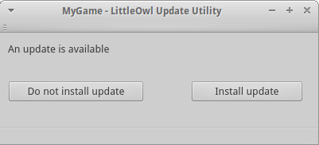

# little-owl
This is an update utility for programs and games. It is started before 
the actual main program and checks on the server for updated files. If
updated files exist, the program downloads and replaces them.

The check for updates is done on a per file basis, which is especially
useful for programs in development/test-phase with many minor changes. 
A "per version" update functionality is planned.

Bot the client (child) and the server (parent) are written in C++ using
Qt5. Little-owl is still in development. If you want to use it and/or 
take part in the development, just write me.

## How it works

When you updated your code, run the parent application on the server 
where your current version is stored. An index file is generated that 
encodes the current state of the files. This can also be done as part 
of a build script. The command

```
./Parent -f "./files" -r "https://updates.example.com/files/" -i "./index.json"
```

creates the index-file *index.json* that encodes the directory 
*files* which is accessed by the client at the url 
*https://updates.example.com/files/*.

On the client side, instead of starting the actual program or game, the
update utility is started. Little-owl compares the local files to the
index file from the server and tells the user if an update is 
available. The user can install the updates or skip it.



After the installation, the user can start the actual program.


The client is configured using the file *setting.ini*. You can find this file
in the resources/Child directory. It must be changed to fit the paths 
of your application and placed in the same directory as the Child 
executable.


## Todos
* Handle subdirectories
* Instead of per file update also allow per version update
* Compression
* Verification
* Translation
* Customizable UI
* Various minor todos (see in code "TODO")
